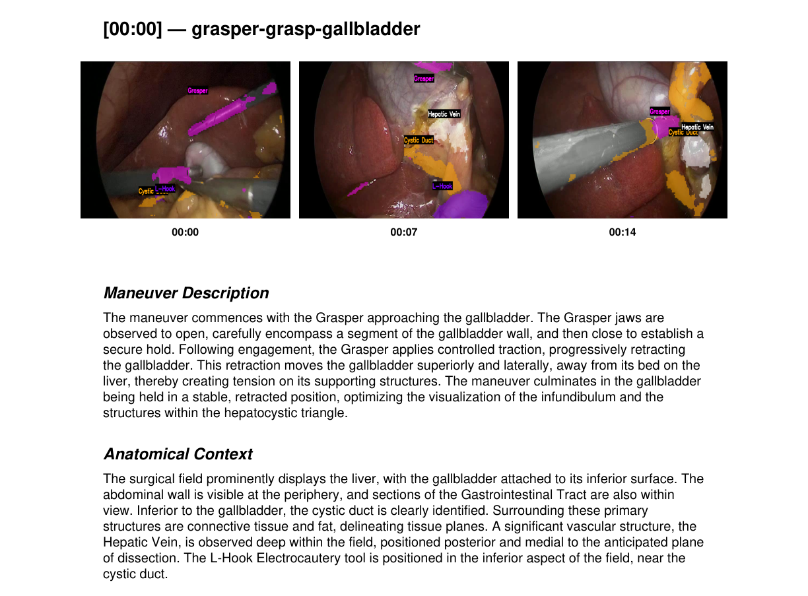

# Autonomous Surgical AI Agent 

An advanced, multimodal AI pipeline designed to autonomously analyze laparoscopic cholecystectomy surgeries. This agent performs real-time surgical action recognition, semantic segmentation of critical anatomy and tools, and leverages Vision-Language Models (VLMs) to generate professional clinical reports with temporal context.



## 🌟 Key Features

*   **Real-Time Action Recognition:** Utilizes the [Rendezvous](https://github.com/CAMMA-public/rendezvous) architecture to accurately identify surgical action triplets (Instrument, Verb, Target) dynamically from surgical video feeds.
*   **Semantic Scene Segmentation:** Employs a custom-finetuned **SegFormer-B2** model (trained on CholecSeg8k) to perform pixel-perfect segmentation of 10 critical classes, including the cystic duct, hepatic vein, liver, and surgical instruments.
*   **Temporal VLM Analysis with Visual Grounding:** Extracts the Start, Middle, and End frames of every surgical action. These frames are augmented with precise segmentation outlines and semantic class labels before being fed sequentially into Gemini 2.5 Flash. This deterministic spatial context allows the LLM to generate highly accurate clinical insights, maneuver intent, and safety observations without hallucinating anatomy.
*   **Action Clip Generation:** Dynamically splices the full surgical video into discrete, action-specific clips (e.g., `grasper-grasp-gallbladder.mp4`). Each clip is overlaid with real-time semantic segmentation masks, providing immediate visual grounding and verification for the reviewing clinician.
*   **Automated PDF Reporting:** Dynamically generates a highly professional, clinical-grade PDF report for the entire surgery using `reportlab`. The report features side-by-side temporal visualizations with embedded timestamps and structured clinical notes.
*   **ONNX Runtime Quantization:** The heavy SegFormer model is converted to ONNX and statically quantized. This drastically reduces the memory footprint and accelerates CPU inference speeds, enabling the pipeline to run efficiently in lightweight Docker containers without requiring a GPU.
*   **Live Telemetry Dashboard:** A sleek Streamlit interface providing real-time inference latencies across the PyTorch, ONNX, and API boundaries.

## Hosted Models (Hugging Face)

To make deployment seamless, all heavy model checkpoints have been moved out of the repository and are now hosted on the **Hugging Face Hub**. The application will automatically pull the necessary weights upon initialization, resulting in a lightweight codebase.

> **View Training Metrics & Evaluation Logs:**  
> Detailed training curves, hyperparameter tuning, and class-wise Dice scores for the SegFormer model are available on [Weights & Biases (WandB)](https://wandb.ai/vai-jss-university/surgical-agent-segformer/runs/djqur8be/overview?nw=nwuserimvaibhavrana).

---

## 🛠️ Quick Start (Docker)

The easiest way to run the Surgical Agent locally is via Docker Compose. This ensures all OpenCV headless dependencies and CPU-optimized PyTorch wheels are installed perfectly.

### Prerequisites
*   [Docker Desktop](https://www.docker.com/products/docker-desktop/)
*   A Gemini API Key from Google AI Studio

### 1. Configure Environment
Clone the repository and set up your `.env` file:
```bash
git clone https://github.com/vaibhav34777/surgical-agent.git
cd surgical-agent
cp .env.example .env
```
Edit the `.env` file and insert your actual `GEMINI_API_KEY`.

### 2. Run with Docker Compose
```bash
cd tests/deployments
docker compose up --build
```

The application will spin up two containers:
*   **Frontend (Streamlit):** [http://localhost:8501](http://localhost:8501)
*   **Backend API (FastAPI):** `http://localhost:8000`

> **Note:** On the very first run, the API container will automatically download the required ML models from Hugging Face. Depending on your connection, this may take a few moments. Please wait until the backend is fully initialized before starting an analysis.

---

## 💻 Local Development Setup (Without Docker)

If you wish to run the project natively for development:

1. **Install Dependencies**
   ```bash
   pip install -r inference/api/requirements.txt
   pip install -r inference/frontend/requirements.txt
   ```

2. **Start the FastAPI Backend**
   ```bash
   uvicorn inference.api.main:app --host 0.0.0.0 --port 8000
   ```
   *(Note: Do not use the `--reload` flag during analysis testing, as it will reset the in-memory state when files are generated).*

3. **Start the Streamlit Frontend**
   ```bash
   cd inference/frontend
   streamlit run app.py
   ```

---

## 📊 Sample Output & Demonstration

To quickly test the application without hunting for surgical datasets, check out the `examples/` directory:

*   **`examples/sample_surgery_clip.mp4`**: A short 15-second clip you can upload directly to the Streamlit UI to watch the real-time segmentation and VLM analysis in action.
*   **`examples/sample_clinical_report.pdf`**: An example of the final automated PDF output, showcasing the temporal keyframes, Markdown parsing, and structured clinical intent.

---

## 🧠 Architecture Overview

1.  **Frontend (`app.py`)**: A Streamlit interface that handles video uploads, maintains session state, and connects to the backend via Server-Sent Events (SSE) for real-time, non-blocking UI updates and progress tracking.
2.  **FastAPI Backend (`main.py` & `analyze.py`)**: A highly concurrent API built with FastAPI. It utilizes `BackgroundTasks` to offload heavy video processing, ensuring the main thread remains responsive.
    *   **SSE Streaming (`stream.py`)**: Pushes real-time telemetry, status updates, and segmented action clips back to the client the moment they are generated.
    *   **Thread-Safe State Management (`job_store.py`)**: Implements a robust, file-backed locking mechanism to persist inference results across server reloads and parallel processing threads, ensuring no data loss before PDF generation.
3.  **Orchestrator (`orchestrator.py`)**: The brain of the CV pipeline. It iterates through the video using asynchronous threading to prevent blocking. It orchestrates the Rendezvous model for action boundary detection, the ONNX SegFormer model for masking, and compiles the 3-frame sequences.
4.  **VLM Integration (`agent/core.py`)**: Manages the strict prompting structure for Gemini, ensuring outputs are formatted with professional medical headings (Maneuver Description, Anatomical Context, Clinical Intent, Safety Observations).
5.  **Reporting (`pdf_generator.py`)**: Parses the VLM Markdown outputs via Regex and generates a side-by-side temporal visual layout using ReportLab.

## 📝 Acknowledgements

- **Rendezvous Model**: Action recognition is powered by the architecture described in [Nwoye et al., 2022](https://github.com/CAMMA-public/rendezvous).
- **CholecT50 & CholecSeg8k**: Datasets used for training the action recognition and semantic segmentation models respectively.
